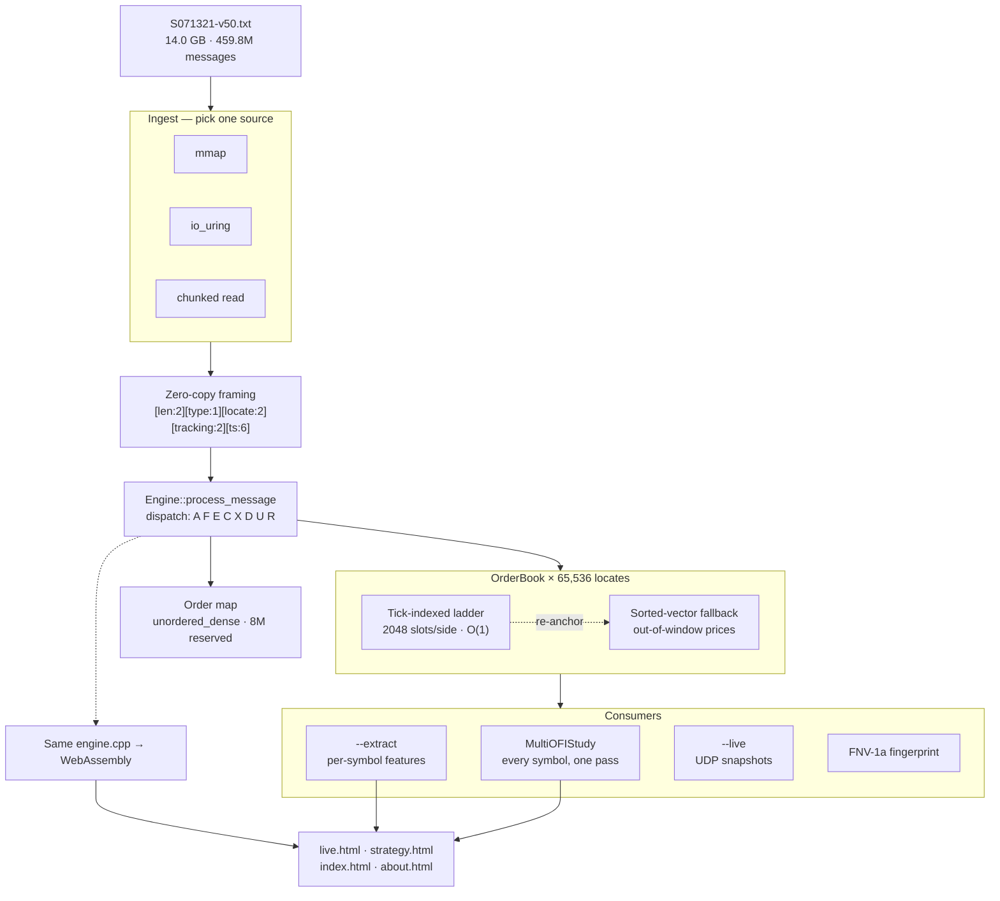

# PitchFork

**A NASDAQ ITCH 5.0 limit-order-book engine, a cross-sectional signal backtester, and the same engine compiled to WebAssembly so you can watch it rebuild a real trading day in your browser.**

PitchFork ingests raw exchange order flow — every add, cancel, replace and execution NASDAQ
published on a given day — and reconstructs the full limit order book for every symbol on the
tape. It does that for **459,781,103 messages in 51.6 seconds (8.9M msg/s, 271 MB/s)** with a
**153 ns median per-message dispatch latency**, then runs a signal study across all **6,307
symbols in the same pass**.

Everything below is measured on the tape named in each table, not estimated.

| | |
|---|---|
| **Ingest throughput** | 8.91M msg/s · 271 MB/s |
| **Per-message dispatch** | 153 ns median · 458 ns p99 · 760 ns p99.9 |
| **Full tape** | 459,781,103 messages · 14.0 GB · 51.6 s |
| **Book reconstruction** | O(1) top-of-book, every level of every symbol |
| **Determinism** | 11 build/engine variants → 1 identical book fingerprint |
| **Native vs WebAssembly** | 16.37M vs 17.33M msg/s on the same workload |
| **Test data** | `S071321-v50.txt` — NASDAQ TotalView-ITCH 5.0, 2021-07-13 |
| **Test machine** | 13th Gen Intel Core i7-13650HX |

---

## Table of contents

- [What you can actually look at](#what-you-can-actually-look-at)
- [Architecture](#architecture)
- [Design decisions and what they cost or bought](#design-decisions-and-what-they-cost-or-bought)
  - [1. The order book: tick-indexed ladder](#1-the-order-book-tick-indexed-ladder--140)
  - [2. The hash map: unordered_dense](#2-the-hash-map-ankerlunordered_dense--120)
  - [3. Pre-sizing the order map](#3-pre-sizing-the-order-map--106)
  - [4. I/O: io_uring lost](#4-io-io_uring-lost-to-a-plain-chunked-read--07)
  - [5. Compiler flags](#5-compiler-flags--299)
  - [6. Determinism as a fingerprint](#6-determinism-as-a-fingerprint)
  - [7. One engine, two targets](#7-one-engine-two-targets-native-and-wasm)
  - [8. Snapshot cut](#8-the-snapshot-cut-premarket-costs-zero-bytes)
  - [9. Chunked gzip](#9-chunked-gzip-and-progressive-replay)
  - [10. Message-granular pacing](#10-message-granular-pacing)
  - [11. Native feature extraction](#11-native-feature-extraction-instead-of-a-bigger-slice)
  - [12. Medians, not means](#12-medians-not-means)
  - [13. The cost model](#13-the-cost-model-is-the-whole-story)
  - [14. The liar detector](#14-the-liar-detector)
  - [15. Deleting the frontend](#15-deleting-the-frontend)
- [Benchmarks](#benchmarks)
- [What the backtest actually found](#what-the-backtest-actually-found)
- [Build and run](#build-and-run)
- [Data pipeline](#data-pipeline)
- [Deploying](#deploying)
- [Repo layout](#repo-layout)
- [Limitations](#limitations)

---

## What you can actually look at

Four static pages, no server, no build step. All data comes from `S071321-v50.txt`
(NASDAQ TotalView-ITCH 5.0, 2021-07-13).

| Page | What it is |
|---|---|
| **`live.html`** | Real recorded order flow replayed through the C++ engine **in your tab**, paced by exchange timestamps. Depth ladder, trade tape, candles (1s/10s/1m + VWAP), and an OFI backtest trading live against the rebuilt book at a latency you choose. Pick a **19 MB** 20-minute cut or the **222 MB** full session. |
| **`index.html`** | The full-day backtest report: 6,307 symbols, one signal, with Sharpe/Sortino/Calmar, rolling Sharpe, latency decay, walk-forward, cost stress and sanity guards. Every chart is hoverable. |
| **`strategy.html`** | The Strategy Lab. Write a JavaScript function `f => position in [-1,1]`; it runs against the real rebuilt book across **any of the 3,071 tickers on the tape**, with per-symbol Sharpe/Sortino/Calmar/profit-factor/drawdown. Eleven presets. Extraction is cached, so a tweak re-runs instantly. |
| **`about.html`** | Interactive performance page — every number in the [Benchmarks](#benchmarks) section, rendered live from `bench.json`. |

`live-native.html` is a local-only extra: it watches the **native** binary parse the tape at
millions of messages a second and streams a book into the page over UDP.

---

## Architecture



The core loop is deliberately boring: frame a message, dispatch on one byte, mutate one side of
one book, update a cached best. Everything expensive — studies, snapshots, feature extraction —
hangs off that loop and is gated so it costs nothing when disabled.

---

## Design decisions and what they cost or bought

Every claim in this section is a measured delta. Each engine optimization can be compiled out
with a `-D` flag, so "worth 1.40×" means *the same binary, one thing disabled, same tape*. The
build variants are in [`tools/build_variants.sh`](tools/build_variants.sh) and the harness is
[`tools/bench.py`](tools/bench.py).

### 1. The order book: tick-indexed ladder — **1.40×**

**The problem.** A limit order book is a sorted map from price to resting quantity, and it is
mutated tens of millions of times a second. The textbook answer is `std::map<price, level>` or a
sorted vector with binary search. Both make you pay `O(log n)` — and worse, a pointer chase or a
memmove — on the single hottest operation in the system.

**The choice.** Prices in ITCH are fixed-point integers in 1/10,000ths of a dollar, so they are
already ticks. For any given symbol, essentially all activity happens in a narrow band around the
touch. So each side is a flat `std::vector<uint32_t>` of **2048 slots indexed directly by tick** —
add and remove are an array write. A `sorted-vector fallback` catches the rare out-of-window price
(sub-penny, far-away, pre-anchor), and the ladder **re-anchors itself** when the true best drifts
into the fallback or within `SPAN/8` of an edge.

**The trade.** ~8 KB per side per symbol, and the complexity of a self-healing window. In exchange,
the common path is an array index and the best price is cached.

**Impact — build with `-DPF_SPAN=8` to shrink the window to nothing and force the fallback:**

```
all optimizations   ██████████████████████████████████   8.87 M msg/s
sorted-vector book  ████████████████████████▎            6.34 M msg/s   → the ladder is worth 1.40×
```

### 2. The hash map: `ankerl::unordered_dense` — **1.20×**

**The problem.** Every cancel, replace and execution arrives as an order *reference number*, not a
price. So the engine keeps `order_ref → {price, shares, locate, side}` for every live order — and
this map is hit on nearly every message. `std::unordered_map` is a bucket array of linked-list
nodes: each lookup is a pointer chase to a random cache line.

**The choice.** `ankerl::unordered_dense` — open addressing over a contiguous array. The entries
live in one dense block, so a lookup is far likelier to hit cache.

**Impact — `-DPF_STD_MAP` swaps it back:**

```
all optimizations   ██████████████████████████████████   8.87 M msg/s
std::unordered_map  ████████████████████████████▎        7.39 M msg/s   → unordered_dense is worth 1.20×
```

### 3. Pre-sizing the order map — **1.06×**

**The choice.** `reserve(8'000'000)` and `max_load_factor(0.5)` up front. A day has millions of
live orders; without this the map rehashes repeatedly during the busiest part of the morning, and
runs at a load factor that costs probes.

**The trade.** Memory up front, and a number that has to be justified per-tape.

**Impact — `-DPF_NO_RESERVE`:**

```
all optimizations   ██████████████████████████████████   8.87 M msg/s
no reserve/tuning   ███████████████████████████████▉     8.35 M msg/s   → worth 1.06×
```

Smallest win of the three. Kept because it is one line and costs nothing but RAM.

### 4. I/O: io_uring **lost** to a plain chunked read — **−0.7%**

This is the result I most expected to go the other way, and it is worth stating plainly.

**The hypothesis.** `io_uring` is the modern Linux async I/O interface. Submitting reads through a
shared ring with no syscall per operation should beat `mmap`, whose page faults are synchronous.

**The measurement.**

```
chunked 64 KB  ██████████████████████████████████   8.88 M msg/s   270.4 MB/s
chunked 1 MB   █████████████████████████████████▋   8.81 M msg/s   268.2 MB/s
mmap           ████████████████████████████████▋    8.53 M msg/s   259.5 MB/s
io_uring       ████████████████████████████████▍    8.46 M msg/s   257.6 MB/s
```

**io_uring is 0.7% *slower* than mmap, and a plain 64 KB `read()` loop beats both by 4.2%.**

**Why.** This workload is not I/O-bound. At 8.9M msg/s the engine consumes ~271 MB/s; the NVMe
drive and page cache supply that without breaking a sweat. The bottleneck is the parse-and-mutate
loop, so making I/O asynchronous optimizes something that was never the constraint. The 64 KB
chunked read wins on a second-order effect: it streams through a small, L2-resident buffer, while
`mmap` takes a page fault every 4 KB and `io_uring` adds ring bookkeeping to a queue that is never
deep.

**What was kept.** All three, selectable at runtime (`--io_uring`, `--chunk N`, default `mmap`).
The io_uring path stays because it is the right answer if the tape ever moves to slower or remote
storage, and because a benchmark you can re-run is worth more than a paragraph asserting it does
not matter. **A negative result you can reproduce is still a result.**

### 5. Compiler flags — **2.99×**

```
-O3 +LTO +native  ██████████████████████████████████   8.91 M msg/s   271.1 MB/s
-O2               █████████████████████████████████▎   8.72 M msg/s   265.3 MB/s
-O0 (no opt)      ███████████▍                         2.98 M msg/s    90.8 MB/s
```

Same source, three flag sets. `-O0 → -O3` is **2.99×** — the single largest multiplier in the
project, and free. Note the shape: **`-O2` captures 98% of it**; `-O3 + LTO + march=native` adds
only 2.2% on top. Worth having, not worth agonizing over, and `march=native` is a real portability
cost for a 2% gain if you ever ship binaries.

### 6. Determinism as a fingerprint

**The problem.** Every optimization above is a chance to silently corrupt the book. "It got faster"
is worthless if it also got wrong, and a book is far too large to eyeball.

**The choice.** After the last message, walk every level of every side of all 65,536 books and fold
them into one FNV-1a hash. One `uint64` that summarises the entire final state of the market.

**Impact.** All **11** runs in the benchmark table — four I/O sources, three optimization levels,
four engine variants — produce byte-identical books:

```
1469598103934665603
```

The same hash comes out of the WebAssembly build. This is what makes the whole benchmark table
trustworthy: **every variant is provably computing the same answer, just at different speeds.**

### 7. One engine, two targets (native and WASM)

**The choice.** The browser does not get a JavaScript reimplementation of the order book. It gets
`engine.cpp` compiled to WebAssembly through a thin C ABI (`wasm/bindings.cpp`). One source of
truth, one set of bugs.

**Impact**, on the same 22.8M-message workload:

| | throughput |
|---|--:|
| native C++ | 16.37M msg/s |
| WebAssembly | 17.33M msg/s |

Parity — WASM is not the bottleneck, and it is not a toy port. (The two differ by ~6% in WASM's
favour, which mostly says the two runs are within noise of each other on a workload that fits in
cache; the honest reading is "the same".)

### 8. The snapshot cut: premarket costs zero bytes

**The problem.** To show the market at 09:30 you must first process every message since 04:00,
because the book at 09:30 *is* the accumulated result of all of them. Shipping those bytes to a
browser to watch the open is enormously wasteful.

**The choice.** The slicer replays everything before the cut through an order tracker, then emits
the resulting live orders as **synthetic ITCH Add messages carrying their original reference
numbers**. The browser's engine cannot tell the difference — it just sees adds — and the book is
exact from the first message.

**Impact.** The premarket costs zero bandwidth, and the replay is byte-exact from the cut. The
20-minute lite tape is 1.96M messages instead of the ~50M it would take to reach 09:25 honestly.

> **Gotcha for anyone reading the slicer:** the first message in a slice is an early stock-directory
> `R` record from ~03:06, *not* the start of the data. Consumers must seek using `meta.span.from`.

### 9. Chunked gzip and progressive replay

**The constraint.** Cloudflare Pages refuses any file over 25 MiB. The full session is 687 MB raw.

**The choice.** The slicer rotates output at message boundaries into independent gzip chunks of
≤20 MB (largest actual: 17.5 MB). The browser inflates each with `DecompressionStream` into a
pre-allocated buffer and **starts replaying after the first chunk lands**, streaming the rest in
behind you.

**Impact.** 687 MB → 222 MB on the wire (~32%), under the CDN limit, and time-to-first-book is one
chunk instead of the whole day.

### 10. Message-granular pacing

**The bug.** Replay stuttered visibly at 1×. Measuring rather than guessing found why: an 8 KB
feed block spans a **median of 71 ms but a p90 of 1.03 seconds** of market time. Feeding whole
blocks and sleeping between them means a >1s jump 10% of the time.

**The fix.** `engine_feed_until(chunk, len, target_ts)` consumes messages only up to a target
timestamp, so pacing happens *inside* the block, at message granularity.

**Impact.** The stutter is gone, and feed/feed_until were verified to produce identical books.

### 11. Native feature extraction instead of a bigger slice

**The problem.** The Strategy Lab was limited to whatever symbols were in the shipped slice — six.
The obvious fix is a bigger slice, but the browser holds the decompressed day in one `Uint8Array`:
20 symbols would be ~1.3 GB of RAM and would kill a phone.

**The choice.** Don't slice at all. `--extract` sweeps the **original 14 GB tape** with the native
engine and dumps each symbol's feature series (`t, mid, spread, ofi, imb` as raw float64, sampled
every N messages) to one file per symbol. The Lab fetches only what you click.

**Impact:**

| | before (WASM replay of a slice) | after (native extraction) |
|---|--:|--:|
| symbols available | 6 | **3,071** |
| up-front download | 222 MB | **0** |
| per-symbol fetch | — | ~60–90 ms (median symbol 52 KB) |
| sweep cost | — | 100 s, once, offline |

The Lab still falls back to in-browser WASM replay when no feature files are present, because
watching the engine rebuild the book in your tab is the more impressive demo — it is just the
worse tool. Note the two paths do **not** sample identically: the WASM path can only inspect the
book between 64 KB feed blocks, so its effective interval is ~4.5× coarser than requested
(AAPL over the same window: 45,848 native samples vs 10,265 WASM). The feature *values* agree;
the density does not.

### 12. Medians, not means

**The problem.** The tape has 6,307 symbols with enough samples to test. Most are illiquid, and an
illiquid symbol has a garbage quote — a $0.02 stock with a $0.01 spread is a 50% round-trip cost.
Average anything across that population and the thin names decide the answer.

**Evidence, from this repo's own results:** the **sum** of gross P&L across all symbols is
**−$993,316**, while the **median** symbol's gross is **+190.57 bps**. Same data. The mean says the
signal is worthless; the median says it has real edge. The mean is the one that is lying.

**The choice.** Every cross-sectional aggregate is a median (`nth_element`), never a mean.

### 13. The cost model is the whole story

**The choice.** Charge the **quoted half-spread per share on every position change**, and mark
positions **mid-to-mid**. No optimistic fills, no assumed rebates, no crossing for free.

**Impact.** This is the difference between a portfolio project that lies and one that does not:

| | pooled result |
|---|--:|
| directional hit-rate | **55.28%** (5,890,421 samples) |
| median symbol, gross | **+190.57 bps** |
| median symbol, **net of spread** | **−6,199.94 bps** |
| symbols profitable **net of costs** | **13 / 6,307** |

The signal is real and it is not close to enough. See
[What the backtest actually found](#what-the-backtest-actually-found).

### 14. The liar detector

A backtest that cannot embarrass you is decoration. Every run emits, unprompted:

- **Latency sweep** — the same signal executed only after a market-time delay (0 → 1s). If edge
  does not decay with reaction time, it was never real.
- **Walk-forward** — tune the interval on the morning, judge it on the afternoon, report the
  out-of-sample number.
- **Cost stress** — ½× / 1× / 2× the spread.
- **Sanity guards** — timestamp regressions (`0`), crossed-book samples (`1,558`), and a
  too-good-to-be-true flag that trips if median net exceeds 20 bps/symbol (`false`).
- **Reproducibility manifest** — git commit, build timestamp, data bytes, message count, book
  fingerprint, interval and the cost model, embedded in the results JSON.

The latency sweep is the one that matters most:

```
reaction delay      hit-rate     median gross bps
0 ns                55.28%       +190.57
100 µs              55.27%       +190.57
1 ms                54.99%       +186.84
10 ms               54.50%       +176.65
100 ms              53.76%       +156.83
1 s                 52.51%       +119.76
```

Edge decays monotonically toward coin-flip as you get slower. That is exactly the shape a real
microstructure signal should have, and it is strong evidence there is no lookahead leak.

### 15. Deleting the frontend

The project briefly had a Next.js app and a Node WebSocket bridge. Both were deleted.

**Why.** They forced a running server for something with no server-side state. Once the engine
compiles to WASM, the browser *is* the backend — the pages need a static host and nothing else.
That kills the bridge, the build step, the dependency tree, and the hosting bill in one move.

**Impact.** 13 files deleted; deployment became `wrangler pages deploy report`. The one thing lost
is the native live view, which genuinely needs a local process — so it is kept as
`live-native.html`, explicitly local-only, rather than pretending it works hosted.

---

## Benchmarks

**Machine:** 13th Gen Intel Core i7-13650HX · **Tape:** `S071321-v50.txt` (NASDAQ TotalView-ITCH
5.0, 2021-07-13, 14.0 GB, 459,781,103 messages) · **Date:** 2026-07-16 · full-tape runs, device in
performance mode.

Reproduce: `tools/build_variants.sh && python3 tools/bench.py Binaries/S071321-v50.txt`
→ writes [`report/bench.json`](report/bench.json) (rendered live on `about.html`) and
[`docs/benchmarks.md`](docs/benchmarks.md).

### Ingest — by I/O source

```
chunked 64 KB  ██████████████████████████████████   8.88 M msg/s   270.4 MB/s
chunked 1 MB   █████████████████████████████████▋   8.81 M msg/s   268.2 MB/s
mmap           ████████████████████████████████▋    8.53 M msg/s   259.5 MB/s
io_uring       ████████████████████████████████▍    8.46 M msg/s   257.6 MB/s
```

### Compiler optimization — same source

```
-O3 +LTO +native  ██████████████████████████████████   8.91 M msg/s   271.1 MB/s
-O2               █████████████████████████████████▎   8.72 M msg/s   265.3 MB/s
-O0 (no opt)      ███████████▍                         2.98 M msg/s    90.8 MB/s
```

### Engine — one hand-written optimization disabled at a time

All at `-O3 -march=native`. Each row is the same binary with one thing compiled out.

```
all optimizations   ██████████████████████████████████   8.87 M msg/s   270.1 MB/s
no reserve/tuning   ███████████████████████████████▉     8.35 M msg/s   254.0 MB/s
std::unordered_map  ████████████████████████████▎        7.39 M msg/s   225.1 MB/s
sorted-vector book  ████████████████████████▎            6.34 M msg/s   193.0 MB/s
```

| optimization | disable with | worth |
|---|---|--:|
| tick-indexed ladder | `-DPF_SPAN=8` | **1.40×** |
| `unordered_dense` over `std::unordered_map` | `-DPF_STD_MAP` | **1.20×** |
| `reserve` + load-factor tuning | `-DPF_NO_RESERVE` | **1.06×** |
| `-O3 +LTO +native` over `-O0` | `-O0` | **2.99×** |

**All four engine variants produce the identical book fingerprint `1469598103934665603`** — these
change speed, not answers.

### Per-message dispatch latency

`rdtsc` around `process_message`, warmup discarded. Measured in a separate run: the timing
instrumentation itself costs throughput, so it is kept out of the tables above.

| mean | p50 | p90 | p99 | p99.9 | p99.99 | max |
|--:|--:|--:|--:|--:|--:|--:|
| 172.5 ns | **153 ns** | 285 ns | 458 ns | 760 ns | 3.81 µs | 196.2 µs |

```
p50      153 ns   ▏
p90      285 ns   ▎
p99      458 ns   ▍
p99.9    760 ns   ▋
p99.99   3.81 µs  ███▍
max      196 µs   ██████████████████████████████████
                  (log-scale ladder — hover the chart on about.html for exact values)
```

The p99.99 and max are page faults and scheduler noise, not the engine. The distribution that
matters is p50–p99.9: **153 → 760 ns**, a 5× spread across four nines.

### Native vs WebAssembly

Same `engine.cpp`, same 22.8M-message workload, measured without instrumentation on both sides.

```
WebAssembly  ██████████████████████████████████   17.33 M msg/s
native C++   ████████████████████████████████▏    16.37 M msg/s
```

---

## What the backtest actually found

One pass runs an **order-flow-imbalance (OFI)** signal on **every symbol simultaneously**. OFI is
the classic microstructure predictor: net signed pressure at the touch over an interval should
predict the next interval's mid move.

**It does. It also loses money.**

| metric | value |
|---|--:|
| symbols tested | 6,307 |
| pooled samples | 5,890,421 |
| **pooled directional hit-rate** | **55.28%** (≈ 256σ from chance) |
| median symbol hit-rate | 54.11% |
| symbols beating chance | 4,797 / 6,307 (76%) |
| median symbol, gross | **+190.57 bps** |
| median symbol, net of spread | **−6,199.94 bps** |
| **symbols profitable net of costs** | **13 / 6,307** |

Walk-forward, tuned on the morning and judged on the afternoon:

| interval | train net bps | test net bps | test hit % |
|--:|--:|--:|--:|
| 25 | −8,080.2 | −4,729.3 | 56.2 |
| 50 | −3,938.6 | −2,408.1 | 55.6 |
| 100 | −1,950.7 | −1,276.4 | 53.8 |
| **200** ← chosen | −1,024.5 | **−698.3** | 52.8 |

Read that carefully: the tuner picks the interval that trades *least*, and its reward is to lose
less. The out-of-sample number is negative at every interval.

**The conclusion.** A 55.28% hit-rate over 5.9 million samples is not luck — it is one of the most
robust effects in market microstructure, and it reproduces here across three quarters of the
symbol universe. It is also worth roughly 190 bps gross against a spread that costs thousands.
**The edge is real and the spread is bigger.** Crossing the spread on every signal is simply not a
strategy; capturing it is, which is a different and much harder problem (see
[Limitations](#limitations)).

This is the number the project exists to report honestly. Anything claiming otherwise from data
this clean should be assumed broken.

---

## Build and run

```bash
git submodule update --init
cmake -B build && cmake --build build -j

# full study across every symbol -> report/results.json
./build/orderbook Binaries/S071321-v50.txt --study all \
    --detail AAPL,AMZN,MSFT,NVDA,SPY,TSLA --interval 50 --out report/results.json

# throughput + rdtsc latency histogram
./build/orderbook Binaries/S071321-v50.txt --bench
```

Any ITCH 5.0 day works — NASDAQ publishes samples at `emi.nasdaq.com/ITCH/`. This repo is built
against **`S071321-v50.txt`** (2021-07-13, 14.0 GB).

| flag | what it does |
|---|---|
| `--study SYM\|all` | cross-sectional OFI study; `--out` writes the report JSON |
| `--bench` | rdtsc per-message latency histogram |
| `--io_uring` / `--chunk N` | select the I/O source (default `mmap`) |
| `--extract SYM,…\|all` | dump Strategy Lab features straight off the tape |
| `--live SYM --speed N` | stream a symbol's book over UDP (`--speed 0` = max) |
| `--interval N` | messages per sample (default 50) |

---

## Data pipeline

```bash
./wasm/build.sh                                                  # engine.cpp -> report/engine.{js,wasm}

# browser replay tapes — one command each, both shipped side by side
tools/make_demo.sh Binaries/S071321-v50.txt 6 1500 09:10                    # 222 MB · full session
tools/make_demo.sh Binaries/S071321-v50.txt 6 60 09:25 --variant lite       # 19 MB · 20 min

# Strategy Lab features — every symbol, no slicing
tools/extract.sh Binaries/S071321-v50.txt                        # 3,071 symbols · 332 MB · ~100 s
tools/extract.sh Binaries/S071321-v50.txt 250                    # …or the 250 most active · 140 MB

python3 tools/bench.py Binaries/S071321-v50.txt                  # report/bench.json + docs/benchmarks.md
cd report && python3 -m http.server 8000
```

**Tapes** (`tools/make_demo.sh`) rank symbols by activity, slice the top N into ≤20 MB gzip chunks
under `report/tapes/<id>/`, verify the slice back through the engine, and refresh
`tapes/manifest.json`. `--variant` lets one tape ship at several sizes; `live.html` shows a picker
as soon as the manifest has more than one entry, and defaults to the smallest.

**Features** (`tools/extract.sh`) sweep the original tape and write
`report/features/<tape-id>/<SYM>.f64` plus an activity-ranked `index.json` and a `manifest.json`
of every tape swept. Sweep a second tape and the Lab grows a dataset picker.

Both output directories are **gitignored** — ~550 MB of generated data, rebuildable in about two
minutes, deployed by direct upload rather than committed.

### Caching

`report/_headers` pins the tapes, features and wasm as `immutable` for a year, because a recorded
day is immutable — a re-slice writes a new directory rather than editing one. **The tape downloads
once; every later visit is a cache hit with no network request.** HTML and manifests stay on
`must-revalidate` so a redeploy is visible immediately, and the loaders request every manifest with
`{cache:'no-cache'}` so freshness never depends on header behaviour.

---

## Deploying

`report/` is a self-contained static site.

```bash
tools/package.sh            # audit: required assets, CDN limits, payload breakdown
tools/package.sh 250        # optional: prune each feature set to its top 250 symbols

npx wrangler pages deploy report --project-name pitchfork --branch main --commit-dirty=true
```

**Direct upload, not a git-connected build.** The payload is ~556 MB (222 MB tapes + 332 MB
features) which has no business in a git repo; direct upload takes the built directory as-is, so
the repo stays source-only (~2 MB) and the deploy is one command.

| Cloudflare Pages limit | this site |
|---|---|
| 25 MiB per file | 17.5 MB largest |
| 20,000 files per deployment | ~3,100 |

`tools/package.sh 250` drops the payload to ~360 MB for a faster upload — the Lab fetches per
symbol, so this only narrows the ticker list.

The GitHub Pages workflow (`.github/workflows/pages.yml`) is **manual-only on purpose**: it
deploys from a git checkout, and the data is gitignored, so an automatic run would publish the
pages without their tapes. Use it only if you also commit `report/tapes/` and `report/features/`.
Not Google Drive — virus-scan interstitial and no CORS.

---

## Repo layout

```
include/, src/     engine, order book, strategies, I/O sources, live publisher
  engine.hpp         message dispatch + order map      (-DPF_STD_MAP, -DPF_NO_RESERVE)
  orderbook.hpp      tick ladder + fallback            (-DPF_SPAN=N)
  strategy.hpp       MultiOFIStudy: all symbols, one pass
  source.hpp         mmap / chunked / io_uring behind one ByteSource
wasm/              C ABI bindings + emscripten build script
report/            the static site: 4 pages + theme.css + _headers + generated data
tools/
  make_demo.sh       tape -> gzip chunks + manifest       slice_itch.py, rank_symbols.py
  extract.sh         tape -> per-symbol feature series
  bench.py           the benchmark table above            build_variants.sh
  package.sh         pre-deploy audit
  ws_relay.py        UDP -> WebSocket, for live-native.html
  verify.js          replay a slice back through the engine
  shoot.js/probe.js  headless CDP helpers
docs/              benchmarks.md
third_party/       ankerl::unordered_dense (submodule)
```

---

## Limitations

Stated plainly, because a project that only lists its wins is advertising.

- **The signal loses money.** 55.28% directional accuracy, −6,199.94 median net bps. The spread is
  bigger than the edge. This is reported, not hidden, and it is the correct result.
- **Fills are assumed, not simulated.** Positions mark mid-to-mid and pay the quoted half-spread.
  There is no queue model, so the backtester cannot express the strategy that would actually work
  here — *providing* liquidity rather than taking it.
- **The WASM Lab path under-samples.** It inspects the book between 64 KB feed blocks, making its
  effective interval ~4.5× coarser than requested. The native `--extract` path is exact; the fix is
  to sample inside the C++ loop and it is not done yet.
- **Single day, single tape.** Every number here is 2021-07-13. Nothing is claimed about
  regime-robustness across days.
- **`-march=native`** means the benchmark binaries are not portable. Fine for a benchmark, wrong
  for a release.

### Roadmap

- **Queue-position fill simulation.** ITCH is L3 — every order has a reference number, so a resting
  order's exact queue position is reconstructible. Almost no backtester can honestly claim that,
  and it is the only way to test the passive strategy the results above are begging for.
- Multi-day walk-forward across tapes.
- Sample inside the feed loop so the WASM path matches `--extract` exactly.
